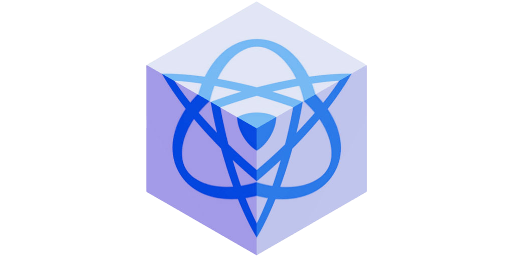
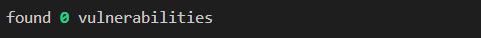

 

# R3F-Pack

A simplified and maintained `react-scripts` alternative.



`react-scripts` is deprecated, but it was good while it lasted.

It now has many out of date dependencies and working with it sometimes requires quite a few manual band-aids.

So I created this `R3F-Pack`. I wrote it for my [R3F examples](https://sbcode.net/react-three-fiber/examples/), and it may work with your existing React code also.

## Video Tutorial

[](https://www.youtube.com/watch?v=w07muxLvPFA&list=PLKWUX7aMnlEK9DrrY1yXdiUBro1CryZaX)

## About

`R3F-Pack` runs very similar to how `react-scripts` works, and your project structure remains the same.

- It serves the dev version on port 3000
- It auto opens the browser at address `http://localhost:3000`
- It enables Hot Module Reloading (HMR) with fast refresh
- It serves the development version from the `./public` folder
- `npm run build` builds a production quality version of your app, and will copy all static files & folders under `./public` to the `./build` folder ready for deployment
- Production `bundle.js` contains a hash in its name to prevent caching
- It supports building with [TypeScript](https://sbcode.net/react-three-fiber/typescript/)
- It indicates 0 vulnerabilities when running `npm install`, at the time of writing this message



## Starting a new Project

To start a brand-new React project, run

```bash
npx new-cra@latest my-app
```

Or, to also include TypeScript

```bash
npx new-cra@latest my-app -ts
```

This will create a very basic React application named `my-app` that you can start developing from.

After the installation has finished,

```bash
cd my-app
npm start
```

Visit http://127.0.0.1:3000

## Installing `R3F-pack` for Existing React Projects

If you already have an existing app that currently uses `react-scripts`, and you want to convert it to use `R3F-pack`, then use these steps below.

First uninstall `react-scripts`

```bash
npm uninstall react-scripts
```

Next, install `r3f-pack`

```bash
npm install r3f-pack --save-dev
```

And then replace the `start` and `build` commands in your existing `scripts` node in your projects `package.json`

```diff
{
    ...
    "scripts": {
-       "start": "react-scripts start",
+       "start": "r3f-pack start",
-       "build": "react-scripts build",
+       "build": "r3f-pack build"
    },
    ...
}
```

## Development

To start in development mode,

```bash
npm start
```

Visit http://127.0.0.1:3000

## Production

To build production

```bash
npm run build
```

A production quality `bundle.js` will be compiled and all static files and folders under `./public` will be copied to the `./build` folder ready for deployment.

Upload or deploy the contents of the `./build` folder to the location served by your web server.

To test your production build locally you can use `http-server`

Install it if you don't already have it.

```bash
npm install --global http-server
```

Start it

```bash
http-server .\build\
```

or if using PowerShell

```bash
http-server.cmd .\build\
```

Visit http://127.0.0.1:8080

## Boilerplate

I have many boilerplate branches that use `R3F-pack` by default. You can have a ready-made project to begin from by following these commands instead.

```bash
git clone https://github.com/Sean-Bradley/React-Three-Fiber-Boilerplate.git
cd React-Three-Fiber-Boilerplate
npm install
npm start
```

There are over 60 branches in the [React-Three-Fiber-Boilerplate](https://github.com/Sean-Bradley/React-Three-Fiber-Boilerplate) repository.

You may decide you want something more sophisticated to begin from, for example, you could switch to the `componentize` branch.

```bash
git checkout componentize
npm install
npm start
```

## Troubleshooting

This is quite a minimal project, and only mimics the basic functionality of `react-scripts`. If it is missing something that you need, I may be able to add it, or if you know how to do it yourself, then you can make a pull request.

### babel-loader doesn't exist

`r3f-pack` and `react-scripts` share some dependencies. However, you can uninstall `react-scripts` before you install `r3f-pack` if you want to keep your code and dependencies neater.

If you uninstall `react-scripts` <u>after</u> you've installed `r3f-pack`, then you will have also uninstalled some dependencies also required of `r3f-pack`

So, you will need to clean up your `./node_modules` folder.

First uninstall `react-scripts`

```bash
npm uninstall react-scripts
```

Next, also uninstall `r3f-pack` just to be sure you got everything.

```bash
npm uninstall react-scripts
```

Then re-install `r3f-pack`

```bash
npm install r3f-pack --save-dev
```

Now start development.

```bash
npm start
```

Your browser should auto open to http://127.0.0.1:3000

Regards

Sean
